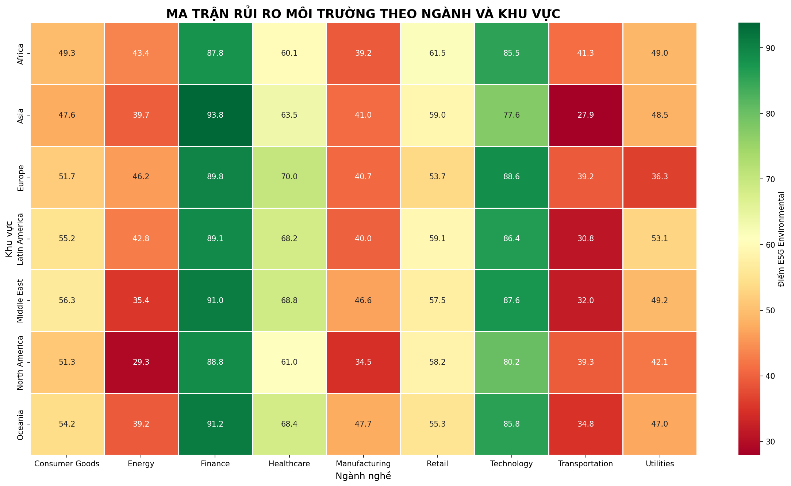
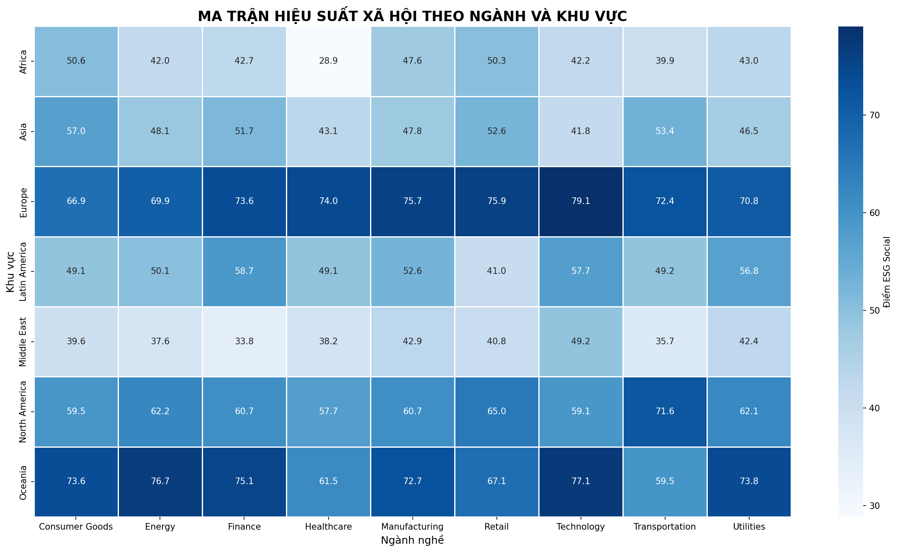
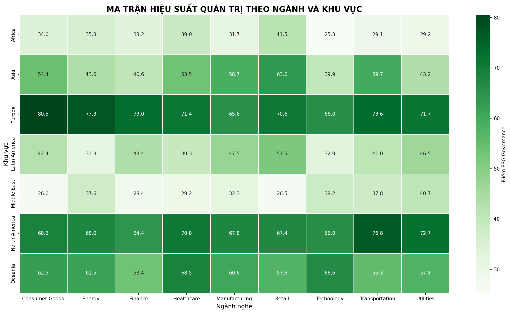

# ESG Analysis

Exploratory data analysis and visualization of ESG indicators across ASEAN countries using Python.

## Project Overview

Environmental, Social, and Governance (ESG) factors are increasingly important in evaluating sustainable development and long-term economic performance.

This project analyzes ESG-related data across ASEAN countries to explore patterns, differences, and trends in environmental, social, and governance performance.

The project focuses on data cleaning, exploratory data analysis, data visualization, and interpretation of analytical findings.

## Objectives

The main objectives of this project are to:

- Explore and understand the structure of the ESG dataset.
- Clean and preprocess the data for analysis.
- Analyze ESG-related indicators across ASEAN countries.
- Identify differences and patterns in ESG performance.
- Visualize the data to communicate key findings effectively.
- Generate meaningful insights from the analysis.

## Dataset

The dataset used in this project was obtained from Kaggle.

**Source:** [ESG Dataset – Kaggle](PASTE-YOUR-KAGGLE-LINK-HERE)

The dataset contains ESG-related indicators used to analyze and compare sustainability performance across countries in the ASEAN region.

The original dataset is not included in this repository. Please refer to the Kaggle source for the raw data.

## Tools & Technologies

- Python
- Pandas
- NumPy
- Matplotlib
- Seaborn
- Jupyter Notebook

## Methodology

### 1. Data Overview

The dataset was examined to understand:

- Dataset dimensions
- Variable types
- Missing values
- Duplicate records
- Key ESG indicators

### 2. Data Cleaning and Preprocessing

The data was prepared for analysis by:

- Handling missing values
- Checking for duplicate records
- Converting variables into appropriate data types
- Preparing the dataset for further analysis and visualization

### 3. Exploratory Data Analysis

Exploratory analysis was conducted to examine ESG-related patterns across ASEAN countries.

The analysis focuses on:

- Overall ESG performance
- Environmental indicators
- Social indicators
- Governance indicators
- Differences between countries

### 4. Data Visualization

Visualizations were created to communicate patterns and differences in ESG performance.

The analysis includes:

- Country-level comparisons
- ESG indicator comparisons
- Environmental performance
- Social performance
- Governance performance

## Key Findings

The analysis reveals differences in ESG-related performance across ASEAN countries.

Key findings and detailed interpretations are presented in the Jupyter notebook and final report.

## Sample Visualizations

### Overall ESG Performance


### Environmental Performance



### Social Performance



### Governance Performance



## Repository Structure

```text
ESG-Analysis/
│
├── data/
│   └── README.md
│
├── images/
│   ├── esg_overview.png
│   ├── environmental.png
│   ├── social.png
│   ├── governance.png
│   └── README.md
│
├── notebooks/
│   ├── ESG_Analysis.ipynb
│   └── README.md
│
├── report/
│   ├── ESG_Analysis_Report.pdf
│   └── README.md
│
├── README.md
└── .gitignore# ESG Analysis

Exploratory data analysis and visualization of ESG indicators across ASEAN countries using Python.

## Project Overview

Environmental, Social, and Governance (ESG) factors are increasingly important in evaluating sustainable development and long-term economic performance.

This project analyzes ESG-related data across ASEAN countries to explore patterns, differences, and trends in environmental, social, and governance performance.

The project focuses on data cleaning, exploratory data analysis, data visualization, and interpretation of analytical findings.

## Objectives

The main objectives of this project are to:

- Explore and understand the structure of the ESG dataset.
- Clean and preprocess the data for analysis.
- Analyze ESG-related indicators across ASEAN countries.
- Identify differences and patterns in ESG performance.
- Visualize the data to communicate key findings effectively.
- Generate meaningful insights from the analysis.

## Dataset

The dataset used in this project was obtained from Kaggle.

**Source:** [ESG Dataset – Kaggle](https://www.kaggle.com/datasets/shriyashjagtap/esg-and-financial-performance-dataset)

The dataset contains ESG-related indicators used to analyze and compare sustainability performance across countries in the ASEAN region.

The original dataset is not included in this repository. Please refer to the Kaggle source for the raw data.

## Tools & Technologies

- Python
- Pandas
- NumPy
- Matplotlib
- Seaborn
- Jupyter Notebook

## Methodology

### 1. Data Overview

The dataset was examined to understand:

- Dataset dimensions
- Variable types
- Missing values
- Duplicate records
- Key ESG indicators

### 2. Data Cleaning and Preprocessing

The data was prepared for analysis by:

- Handling missing values
- Checking for duplicate records
- Converting variables into appropriate data types
- Preparing the dataset for further analysis and visualization

### 3. Exploratory Data Analysis

Exploratory analysis was conducted to examine ESG-related patterns across ASEAN countries.

The analysis focuses on:

- Overall ESG performance
- Environmental indicators
- Social indicators
- Governance indicators
- Differences between countries

### 4. Data Visualization

Visualizations were created to communicate patterns and differences in ESG performance.

The analysis includes:

- Country-level comparisons
- ESG indicator comparisons
- Environmental performance
- Social performance
- Governance performance

## Key Findings

The analysis reveals differences in ESG-related performance across ASEAN countries.

Key findings and detailed interpretations are presented in the Jupyter notebook and final report.

## Sample Visualizations

### Overall ESG Performance


### Environmental Performance


### Social Performance


### Governance Performance


## Repository Structure

```text
ESG-Analysis/
│
├── data/
│   └── README.md
│
├── images/
│   ├── esg_overview.png
│   ├── environmental.png
│   ├── social.png
│   ├── governance.png
│   └── README.md
│
├── notebooks/
│   ├── ESG_Analysis.ipynb
│   └── README.md
│
├── report/
│   ├── ESG_Analysis_Report.pdf
│   └── README.md
│
├── README.md
└── .gitignore
